# ⚡ VITAL — Sistema Inteligente de Gestión Eléctrica

**VITAL** es una plataforma web que digitaliza la relación entre una empresa de servicio eléctrico y sus usuarios: contratos, facturación por consumo real, pagos, emergencias, beneficios sociales y supervisión operativa — todo en una sola aplicación con cuatro perfiles de usuario.

<p align="center">
  <a href="https://TU-USUARIO.github.io/vital/"><strong>▶ Probar la demo en vivo</strong></a> · sin instalación, con los 4 roles precargados
</p>

<p align="center">
  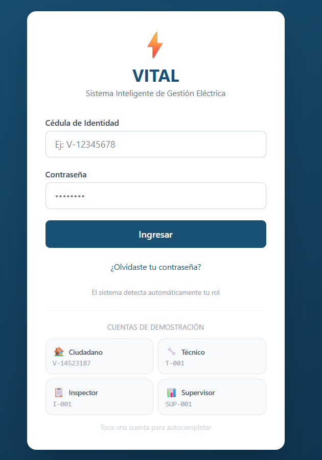
</p>

---

## 🎯 El problema que resuelve

La gestión tradicional del servicio eléctrico depende de procesos manuales: lecturas en papel, pagos sin trazabilidad, trámites presenciales y poca visibilidad del estado operativo. VITAL propone un flujo 100% digital donde:

- El **ciudadano** consulta y paga sus facturas, reporta emergencias con un toque y solicita beneficios sociales sin trasladarse a una oficina.
- El **técnico** en campo escanea el código QR del medidor, registra la lectura y el sistema genera y envía la factura automáticamente.
- El **inspector** evalúa casos de vulnerabilidad y cambios de titularidad con toda la documentación digitalizada.
- El **supervisor** monitorea métricas de las subestaciones en tiempo real y exporta informes.

---

## 🧭 Módulos del sistema

El repositorio contiene el frontend (`VITAL.Web`, React + TypeScript) y el backend (`VITAL.Api`, ASP.NET Core 8 con arquitectura por capas: Domain · Application · Infrastructure · Api · Tests).

La aplicación está organizada por módulos de dominio. Cada módulo sigue el mismo patrón: las **páginas** componen **secciones** (componentes de UI enfocados) y toda interacción emergente vive en **modales** construidos sobre un componente `Modal` reutilizable.

```
VITAL.Web/src/
├── components/          # Compartidos: Layout, Modal, QrScanner, ProtectedRoute
├── api/                 # Cliente HTTP + capa mock para el modo demo
├── context/             # Autenticación y alertas globales
└── modules/
    ├── citizen/         # Módulo Ciudadano
    ├── technician/      # Módulo Técnico
    ├── inspector/       # Módulo Inspector
    └── supervisor/      # Módulo Supervisor
```

---

### 👤 Módulo Ciudadano (`modules/citizen`)

El portal de autogestión del usuario del servicio. Desde un único dashboard con pestañas el ciudadano puede:

| Funcionalidad | Descripción |
|---|---|
| **Contratos** | Ver sus contratos con dirección y medidor, asignarles un nombre personalizado y reportar una **emergencia eléctrica** con un solo toque 🚨 |
| **Facturas y pagos** | Consultar el detalle de cada factura (consumo, período, descuento social) y registrar el pago con referencia bancaria y comprobante |
| **Solicitudes sociales** | Solicitar beneficios de tarifa para grupos vulnerables: *Adulto Mayor en Situación Vulnerable*, *Condición Médica Grave* y *Madre Soltera* — todo el flujo ocurre en modales (selección de tipo → formulario con documentos) |
| **Cambio de titularidad** | Iniciar el traspaso del contrato a un nuevo titular adjuntando la documentación |
| **Perfil** | Actualizar correo, teléfono y contraseña con verificación de identidad |

<table align="center">
  <tr>
    <td align="center">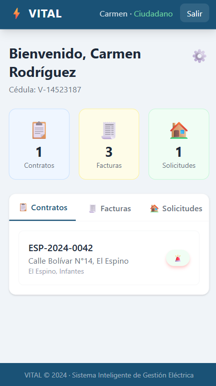<br><em>Dashboard del ciudadano</em></td>
    <td align="center">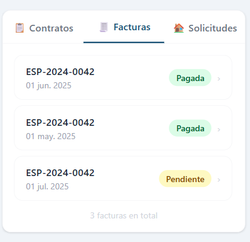<br><em>Historial de facturas</em></td>
  </tr>
  <tr>
    <td align="center">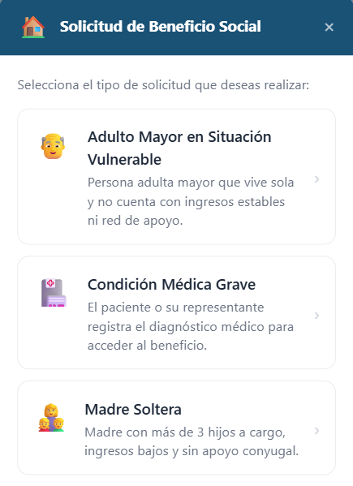<br><em>Solicitud de beneficio social (modal)</em></td>
    <td align="center">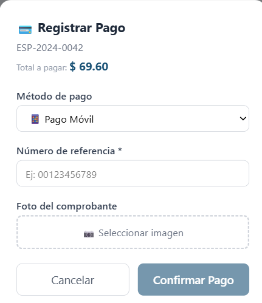<br><em>Registro de pago (modal)</em></td>
  </tr>
</table>

**Estructura interna:**

```
citizen/
├── data/requestTypes.ts   # Catálogo de tipos de solicitud social
├── pages/                 # CitizenDashboard · ProfileSettings
├── sections/              # Stats · Contracts · Invoices · Cases
└── modals/                # ContractDetail · Transfer · InvoiceDetail
                           # PayInvoice · RequestType · RequestForm
```

---

### 🔧 Módulo Técnico (`modules/technician`)

La herramienta de campo del personal operativo, pensada para uso en móvil:

| Funcionalidad | Descripción |
|---|---|
| **Progreso de medición** | Indicador circular con las casas medidas vs. restantes de la jornada |
| **Escáner QR** | Escanea el código QR del medidor con la cámara del teléfono |
| **Lectura y facturación** | Si el medidor existe, registra la lectura en kWh y el sistema **genera y envía la factura automáticamente** |
| **Alta de contratos** | Si el QR no está vinculado, registra el contrato del nuevo cliente en sitio y el medidor queda asociado |
| **Mis Tareas** | Atiende emergencias reportadas por ciudadanos (con evidencia fotográfica de la solución) y ejecuta cambios de titularidad aprobados |

<table align="center">
  <tr>
    <td align="center">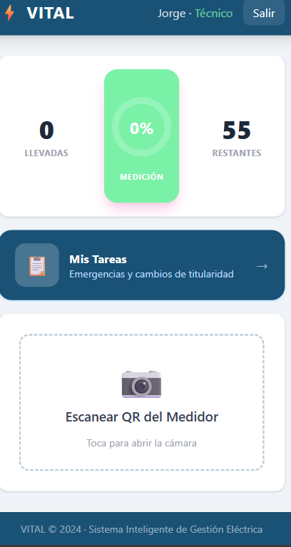<br><em>Dashboard con progreso de medición</em></td>
    <td align="center">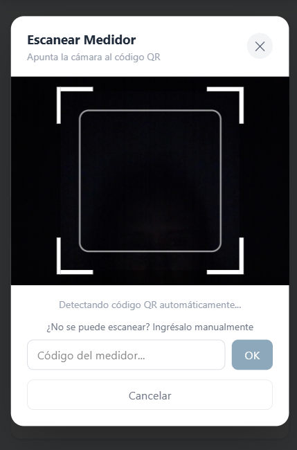<br><em>Escáner QR del medidor</em></td>
  </tr>
</table>

<p align="center">
  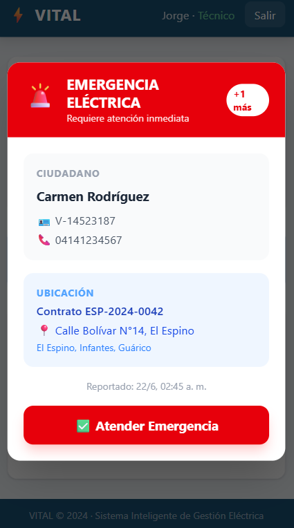<br>
  <em>Alerta de emergencia entrante — llega en tiempo real al técnico de la zona</em>
</p>

**Estructura interna:**

```
technician/
├── pages/                 # TechnicianDashboard · TechnicianIncidents
├── sections/              # Progress · TasksLink · Scanner
│                          # TransfersList · IncidentsList
└── modals/                # Reading · InvoiceGenerated · NewContract
                           # ResolveIncident · CompleteTransfer
```

---

### 🔍 Módulo Inspector (`modules/inspector`)

El rol de control y evaluación de trámites:

| Funcionalidad | Descripción |
|---|---|
| **Panel principal** | Accesos a casos sociales y cambios de titularidad + **calendario de visitas domiciliarias** con las citas programadas |
| **Calendario de visitas** | Máximo 2 visitas por día; fines de semana y feriados bloqueados; al tocar un día se ven las visitas con persona, dirección y motivo |
| **Casos sociales** | Solicitudes de beneficio con filtros por estado y contadores |
| **Revisión en 2 etapas** | Etapa 1: revisa los documentos (aprueba o rechaza con motivo). Etapa 2: programa la visita obligatoria en el calendario, la realiza y aprueba asignando el **grado de riesgo** — el sistema aplica el descuento (25/50/75%) en las facturas del contrato — o rechaza con comentario (ej. fraude) |
| **Cambios de titularidad** | Revisa la documentación de los traspasos y los aprueba (pasan al técnico para ejecución) o rechaza con motivo |

<p align="center">
  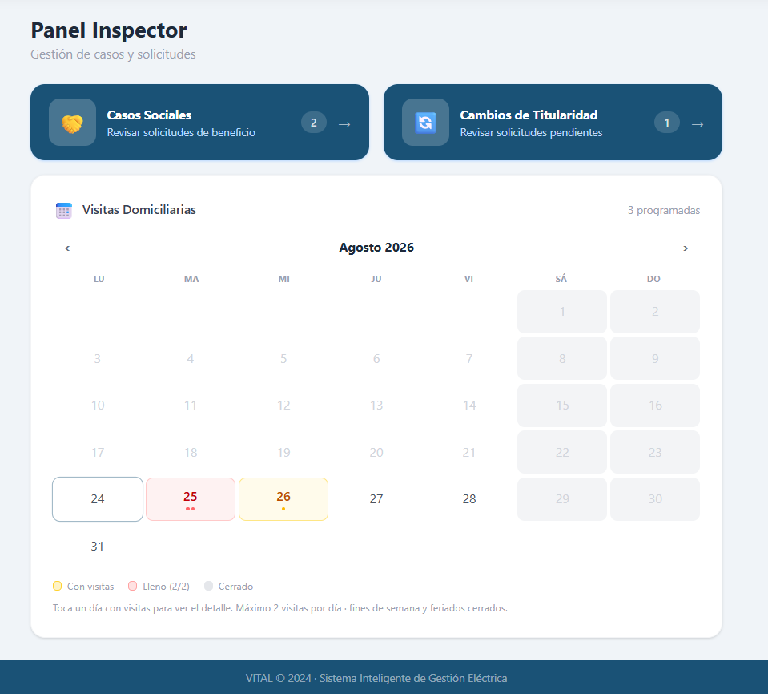<br>
  <em>Panel del inspector — accesos rápidos y calendario de visitas domiciliarias</em>
</p>

<table align="center">
  <tr>
    <td align="center">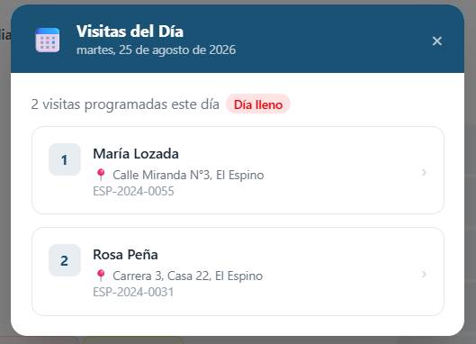<br><em>Visitas del día (modal)</em></td>
    <td align="center">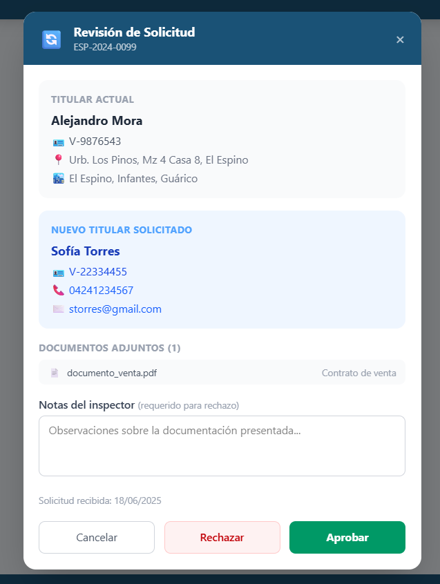<br><em>Revisión de cambio de titularidad (modal)</em></td>
  </tr>
</table>

<p align="center">
  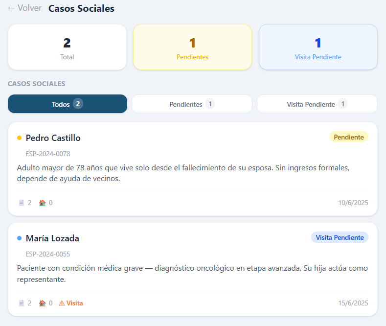<br>
  <em>Casos sociales — filtros por etapa del flujo</em>
</p>

**Estructura interna:**

```
inspector/
├── data/calendarUtils.ts  # Reglas del calendario: feriados, días cerrados, cupo
├── components/            # MonthCalendar (vista y selección de días)
├── pages/                 # InspectorDashboard · SocialCases · CaseDetail
│                          # TransferRequests
├── sections/              # CasesLink · TransfersLink · VisitsCalendar
│                          # InspectorStats · CasesFilter · CasesList
│                          # CaseInfo · CaseDocuments · CaseVisits
│                          # CaseReview · ScheduleVisit · TransferRequestsList
└── modals/                # DayVisits · ReviewTransfer
```

---

### 📊 Módulo Supervisor (`modules/supervisor`)

La vista gerencial del sistema:

| Funcionalidad | Descripción |
|---|---|
| **Métricas globales** | Contratos activos, incidentes, transferencias y solicitudes sociales de toda la red |
| **Subestaciones** | Comparativa por subestación con barras de progreso de resolución |
| **Detalle por subestación** | Rendimiento individual de cada técnico e inspector (asignados, resueltos, pendientes) |
| **Informes** | Exportación CSV de técnicos, inspectores, solicitudes y contratos — global o por subestación |

<p align="center">
  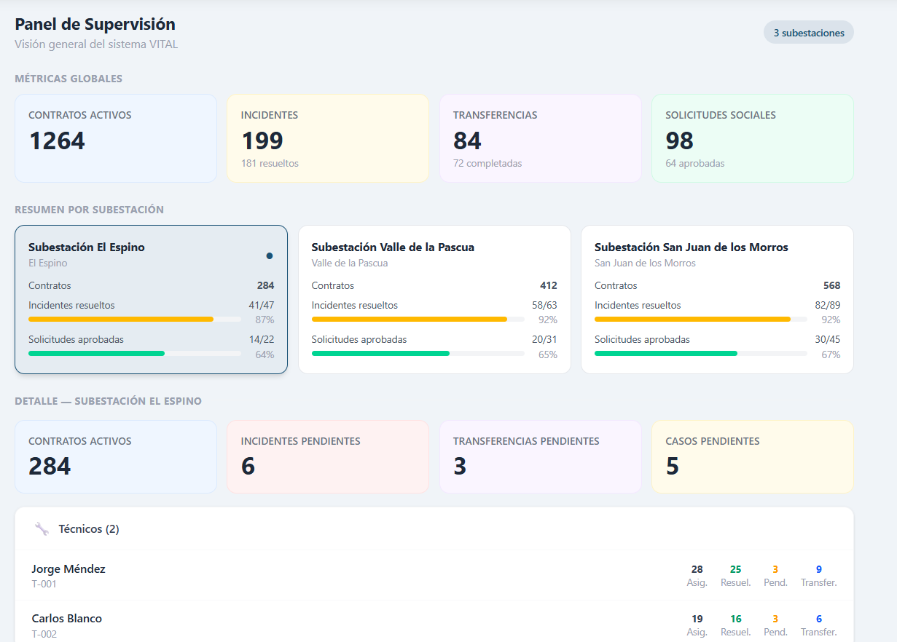<br>
  <em>Métricas globales, comparativa de subestaciones y rendimiento del personal</em>
</p>

<p align="center">
  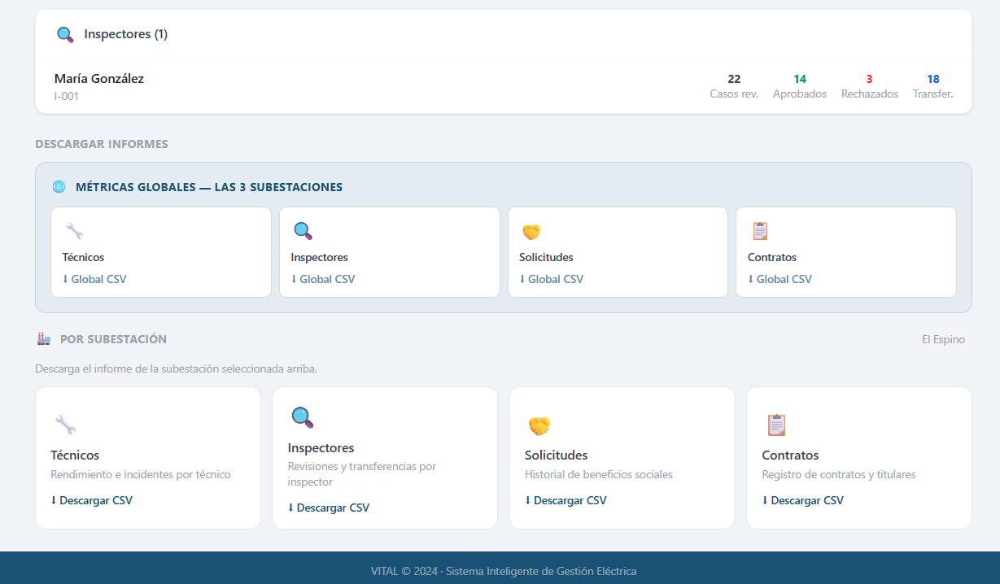<br>
  <em>Exportación de informes CSV — globales o por subestación</em>
</p>

**Estructura interna:**

```
supervisor/
├── data/reportOptions.ts  # Catálogo de informes descargables
├── pages/                 # SupervisorDashboard
└── sections/              # GlobalMetrics · BranchesSummary
                           # BranchDetail · Reports
```

---

## 🧩 Arquitectura de componentes

Dos decisiones de diseño estructuran todo el frontend:

1. **Páginas → Secciones → Modales.** Cada página principal es una composición declarativa de secciones; ninguna página supera las ~200 líneas. Los formularios y confirmaciones viven en modales que manejan su propio estado interno, así el estado de la página se reduce a *qué modal está abierto*.

2. **Componente `Modal` único** (`src/components/Modal.tsx`). Todos los modales del sistema (12 en total) se construyen sobre el mismo componente: header de color configurable, tamaños `sm/md/lg`, hoja inferior en móvil y centrado en escritorio. Incluye el hook `useModal()` con las funciones `openModal()` / `closeModal()`.

```tsx
<Modal open onClose={close} icon="🔄" title="Cambio de Titularidad" subtitle={contract.number}>
  {/* el contenido se adapta a cada caso de uso */}
</Modal>
```

---

## 💡 Cómo mejora la gestión del servicio

- **Facturación por consumo real, sin papel:** la lectura del técnico en campo genera la factura al instante — se eliminan errores de transcripción y semanas de retraso.
- **Trazabilidad de pagos:** cada pago queda registrado con referencia y comprobante, verificable contra el sistema bancario.
- **Justicia tarifaria:** el flujo de beneficios sociales con revisión de inspector y visitas domiciliarias permite subsidiar a quien realmente lo necesita, con evidencia documental.
- **Respuesta rápida a emergencias:** el reporte del ciudadano llega directo al técnico de la zona con dirección y contacto; la resolución exige evidencia fotográfica.
- **Decisiones con datos:** el supervisor ve el rendimiento por subestación y por persona, y exporta la información para análisis.
- **Trámites sin oficinas:** cambios de titularidad y solicitudes se inician desde el teléfono del ciudadano y fluyen por roles hasta su ejecución.

---

## 🛠️ Tecnologías

| Capa | Stack |
|---|---|
| Frontend | React 19 · TypeScript · Vite · Tailwind CSS 4 |
| Ruteo | React Router 7 con rutas protegidas por rol |
| Escáner | html5-qrcode (cámara del dispositivo) |
| HTTP | Axios con proxy a la API |
| Backend | ASP.NET Core 8 · Entity Framework · Swagger *(carpeta `VITAL.Api`)* |

---

## 🚀 Ejecución

### Modo demo (sin backend)

El modo demo reemplaza toda la API por una capa mock en memoria — ideal para probar la aplicación completa sin base de datos:

```bash
cd VITAL.Web
npm install
npm run dev:demo
```

Abre `https://localhost:5173` (acepta el certificado de desarrollo) e inicia sesión con cualquiera de los usuarios de prueba:

| Rol | Usuario | Contraseña |
|---|---|---|
| Ciudadano | `V-14523187` | `Demo123!` |
| Técnico | `T-001` | `Demo123!` |
| Inspector | `I-001` | `Inspector123!` |
| Supervisor | `SUP-001` | `Demo123!` |

*Las acciones de la demo (pagos, resoluciones, aprobaciones) modifican el estado en memoria; al recargar la página todo vuelve al estado inicial.*

### Modo completo (con API)

```bash
cd VITAL.Web
npm run dev        # requiere VITAL.Api corriendo en https://localhost:7060
```

---

<p align="center">
  VITAL © 2024 · Sistema Inteligente de Gestión Eléctrica
</p>
